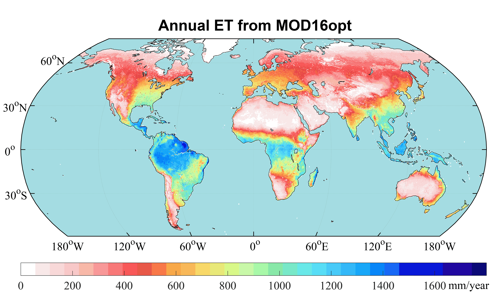

# MOD16_global
This MOD16 algorithm is developed for estimating the global evapotranspiration (ET) and is the core algorithm behind the MODIS ET product, which is original developed by [NTSG](https://www.ntsg.umt.edu/). 

Code Reference: 

> - Mu, Q., Heinsch, F.A., Zhao, M., and Running, S.W. (2007). [Development of a global evapotranspiration algorithm based on MODIS and global meteorology data](https://www.sciencedirect.com/science/article/abs/pii/S0034425707001903). Remote Sensing of Environment *111*, 519–536.
>
> - Mu, Q., Zhao, M., and Running, S.W. (2011). [Improvements to a MODIS global terrestrial evapotranspiration algorithm](https://www.sciencedirect.com/science/article/abs/pii/S0034425711000691). Remote Sensing of Environment *115*, 1781–1800.
>
> - Zhang, K., Zhu, G., Ma, J., Yang, Y., Shang, S., and Gu, C. (2019). [Parameter Analysis and Estimates for the MODIS Evapotranspiration Algorithm and Multiscale Verification](https://agupubs.onlinelibrary.wiley.com/doi/abs/10.1029/2018WR023485). Water Resources Research *55*, 2211–2231.

